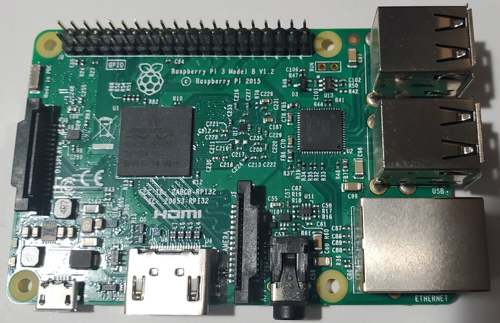
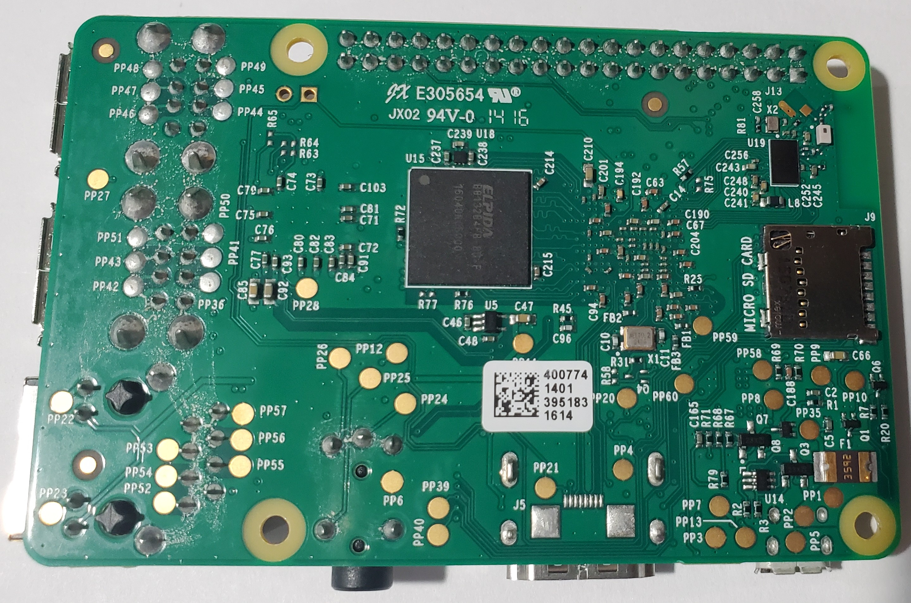
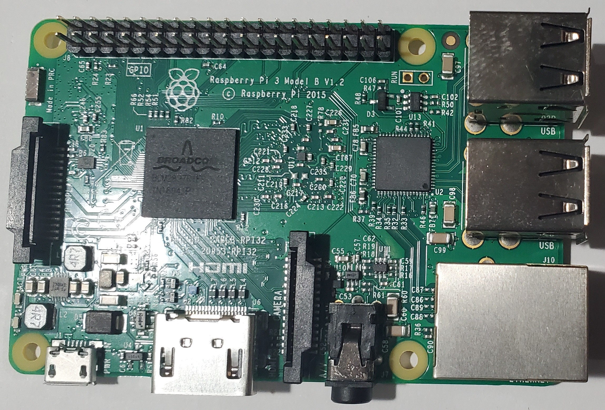
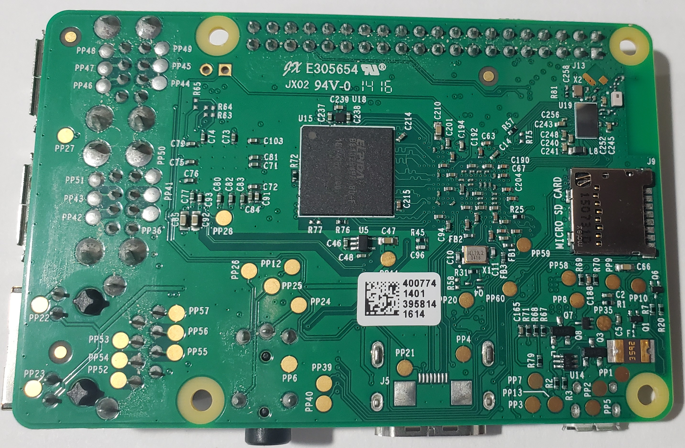
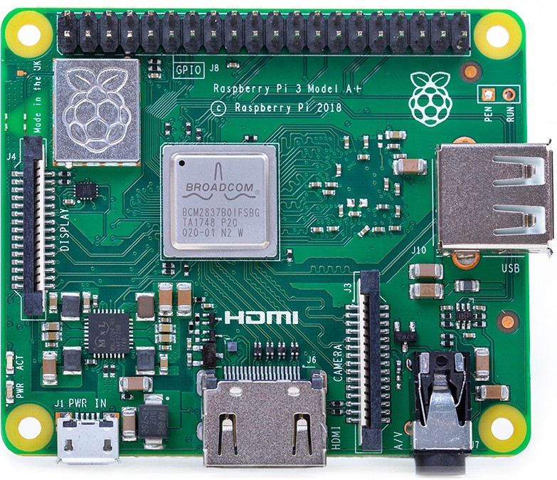
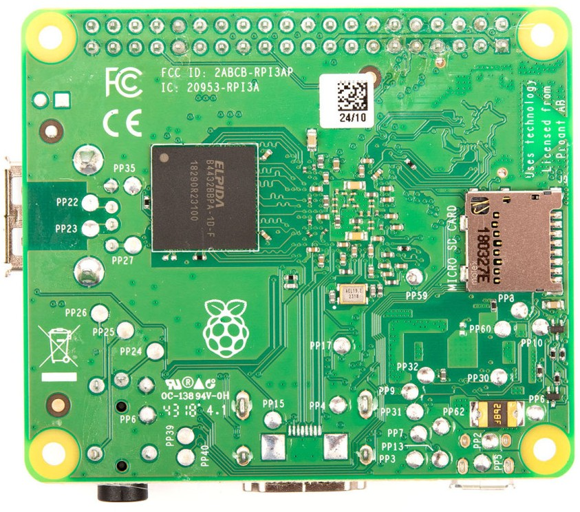

# Raspberry Pi 3B/3B+ Reference

## Board Images

| Model | Rev | Top | Bottom |
|-------|-----|-----|--------|
| 3B    | 1.2 |  |  |
| 3B+   |     |  |  |
| 3B+   | 1.2 |  |  |
| 3A+   |     |  |  |

## Component Reference

| Designator | Component | Function | Notes |
|-----------|-----------|----------|-------|
| U1 | BCM2837 | SoC (ARM Cortex-A53) | Main processor |
| U2 | LAN9514 | USB Hub + Ethernet | See [LAN9514 reference](pi3_lan9514.md) |
| X1 | 19.2 MHz Crystal | Reference clock | Near SD card slot |

## Reference Documents
- [Pi 3B+ Voltage Reference](Pi 3 B Plus Voltage References.md) - Voltage readings at various locations of the board
- [Test Points](pi3_test_points.md) — voltage test pads and diagnostic measurements
- [Power Management](pi3_power_management.md) — PMIC and power rail details
- [LAN9514 USB/Ethernet Hub](pi3_lan9514.md) — USB and Ethernet controller reference

