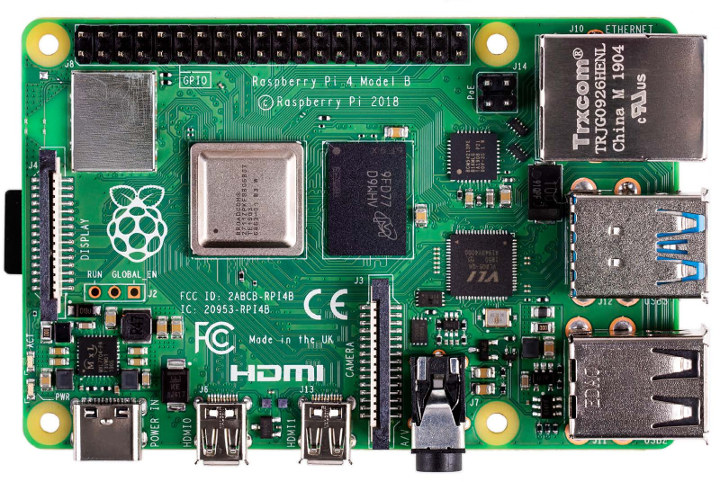
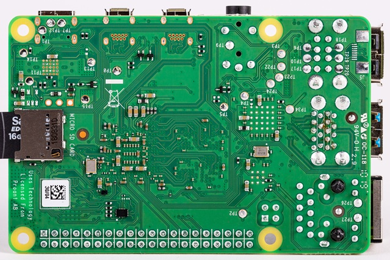

# Raspberry Pi 4B Reference

## Board Images

| Model | Rev | Top | Bottom |
|-------|-----|-----|--------|
| 4B    | 1.1 |  |  |
| 4B    | 1.2 |     |        |
| 4B    | 1.4 |     |        |
| 4B    | 1.5 |     |        |

## C0 Stepping
Seems there are at least two different variants of the SOC with different stepping
Refer to https://www.jeffgeerling.com/blog/2021/raspberry-pi-4-model-bs-arriving-newer-c0-stepping/
for more information

## Reference Documents

* [Revision Identification Thread](https://forums.raspberrypi.com/viewtopic.php?t=319615)