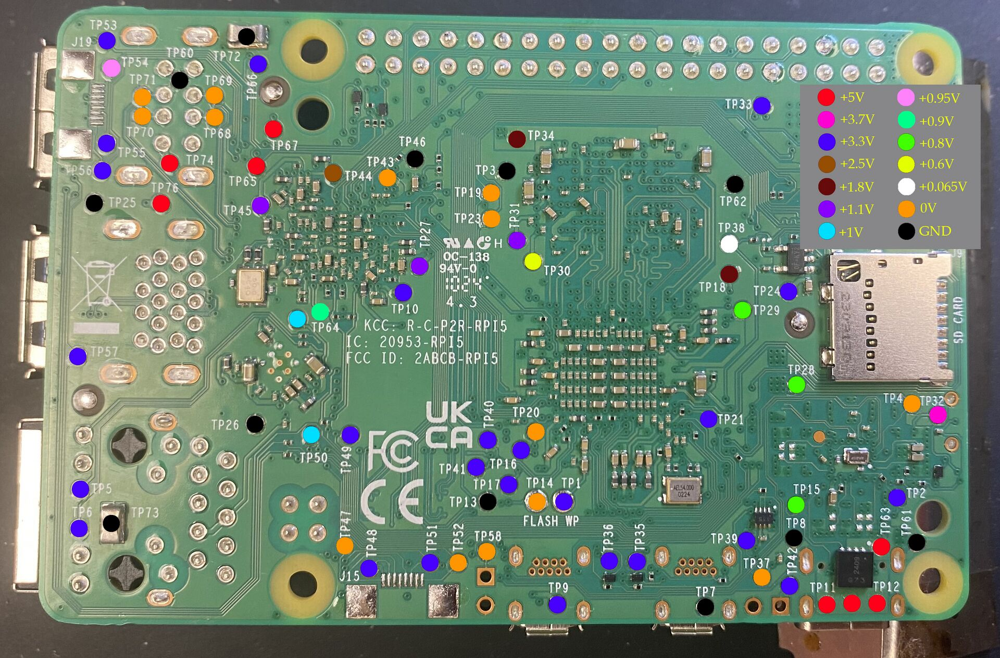

# Raspberry Pi 5 Test Point Voltage Reference

Test point voltages on the underside of the Raspberry Pi 5 board, derived from a
community-created color-coded image.

**Source:** [repair.wiki - Raspberry Pi](https://repair.wiki/w/Raspberry_Pi)

## Test Point Table

| Test Point | Voltage |
|-----------|---------|
| TP1 | +3.3V |
| TP2 | +3.3V |
| TP3 | GND |
| TP4 | 0V |
| TP5 | +3.3V |
| TP6 | +3.3V |
| TP7 | GND |
| TP8 | GND |
| TP9 | +3.3V |
| TP10 | +3.3V |
| TP11 | +5V |
| TP12 | +5V |
| TP13 | GND |
| TP14 | 0V |
| TP15 | +0.8-0.9V |
| TP16 | +3.3V |
| TP17 | +3.3V |
| TP18 | +1.8V |
| TP19 | 0V |
| TP20 | 0V |
| TP21 | +3.3V |
| TP23 | 0V |
| TP24 | +3.3V |
| TP25 | GND |
| TP26 | GND |
| TP27 | +1.1V |
| TP28 | +0.8-0.9V |
| TP29 | +0.8-0.9V |
| TP30 | +0.6V |
| TP31 | +1.1V |
| TP32 | +3.7V |
| TP33 | +3.3V |
| TP34 | +1.8V |
| TP35 | +3.3V |
| TP36 | +3.3V |
| TP37 | 0V |
| TP38 | +0.065V |
| TP39 | +3.3V |
| TP40 | +3.3V |
| TP41 | +3.3V |
| TP42 | +3.3V |
| TP43 | 0V |
| TP44 | +2.5V |
| TP45 | +1.1V |
| TP46 | GND |
| TP47 | 0V |
| TP48 | +3.3V |
| TP49 | +3.3V |
| TP50 | +1V |
| TP51 | +3.3V |
| TP52 | 0V |
| TP53 | +3.3V |
| TP54 | +0.95V |
| TP55 | +3.3V |
| TP56 | +3.3V |
| TP57 | +3.3V |
| TP58 | 0V |
| TP60 | GND |
| TP61 | GND |
| TP62 | GND |
| TP63 | +5V |
| TP64 | +0.8-0.9V |
| TP65 | +5V |
| TP66 | +3.3V |
| TP67 | +5V |
| TP68 | 0V |
| TP69 | 0V |
| TP70 | 0V |
| TP71 | 0V |
| TP72 | GND |
| TP73 | GND |
| TP74 | +5V |
| TP76 | +5V |

## Unlabeled Test Points

| Location | Voltage |
|----------|---------|
| Between TP11 and TP12 (bottom right) | +5V |
| Southwest of TP64 | +1V |

## Voltage Rail Summary

| Rail | Test Points |
|------|-------------|
| +5V | TP11, TP12, TP63, TP65, TP67, TP74, TP76 |
| +3.7V | TP32 |
| +3.3V | TP1, TP2, TP5, TP6, TP9, TP10, TP16, TP17, TP21, TP24, TP33, TP35, TP36, TP39, TP40, TP41, TP42, TP48, TP49, TP51, TP53, TP55, TP56, TP57, TP66 |
| +2.5V | TP44 |
| +1.8V | TP18, TP34 |
| +1.1V | TP27, TP31, TP45 |
| +1V | TP50 |
| +0.95V | TP54 |
| +0.8-0.9V | TP15, TP28, TP29, TP64 |
| +0.6V | TP30 |
| +0.065V | TP38 |
| 0V | TP4, TP14, TP19, TP20, TP23, TP37, TP43, TP47, TP52, TP58, TP68, TP69, TP70, TP71 |
| GND | TP3, TP7, TP8, TP13, TP25, TP26, TP46, TP60, TP61, TP62, TP72, TP73 |

## Notes

- This is a community-sourced reference, not official Raspberry Pi Foundation documentation.
- TP22, TP59, and TP75 are not present in the source image. They may not exist or may be on the top side of the board.
- The source image uses similar shades of green for +0.8V, +0.9V, and +0.95V. Test points marked +0.8-0.9V could not be distinguished between those values visually.
- The distinction between "0V" (orange in source) and "GND" (black in source) is as marked in the original image. Both may be ground references but are color-coded differently by the original author.
- Two test points on the board have colored dots but no visible label in the image.
