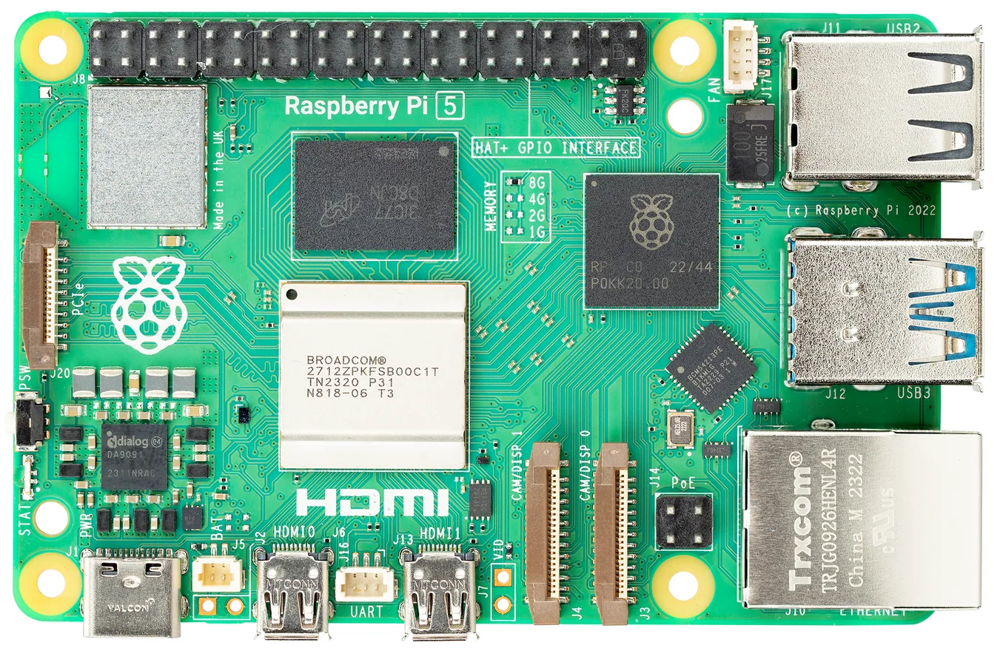
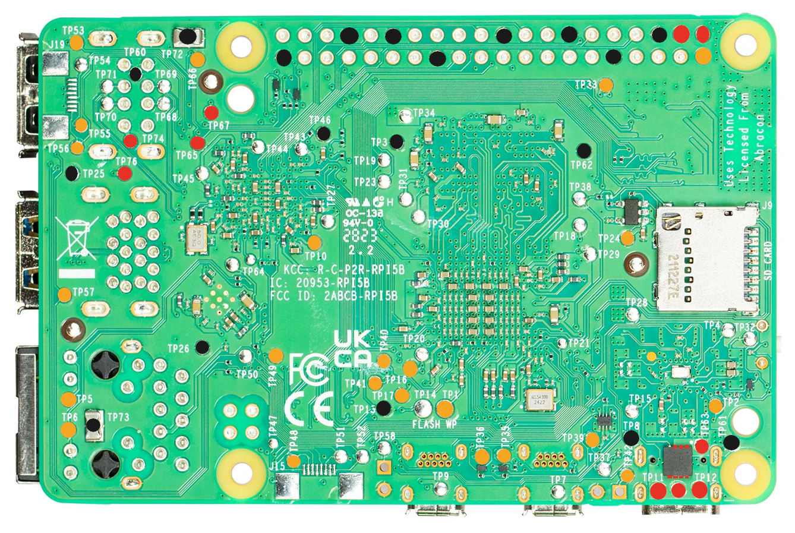

# Raspberry Pi 5 Voltage Reference

## Legend

| Color  | Hex Code  | Voltage |
| ------ | --------- | ------- |
| Black  | `#1a1a1a` | Ground  |
| Red    | `#e63226` | 5v      |
| Orange | `#f5a623` | 3.3v    |
| Blue   | `#4a90d9` | 1.8v   |

## Bare Voltages

The voltages in this section represent a powered on board, with nothing
but the power attached. No display, no SD card inserted, no USB accessories
or ethernet.

### Top

### Bottom

## OS Idle

The OS idle scenario represents a powered on board sitting idle with the
operating system running. It is expected that 1 HDMI display is attached
on HDMI0, the SD card is inserted and the board is booted to the
desktop/cli, but not running any load.

### Top

_Image not yet created._

### Bottom

_Image not yet created._
