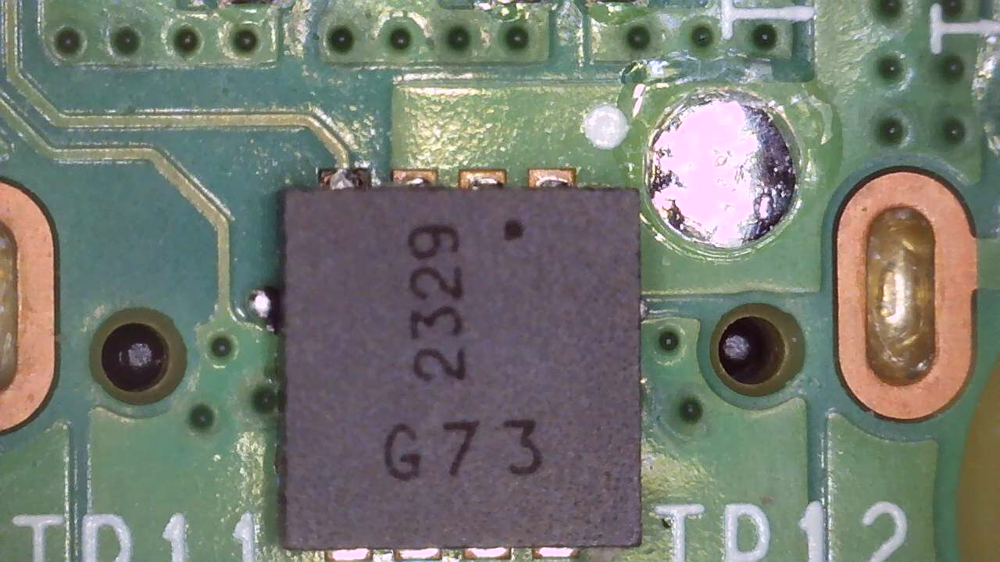
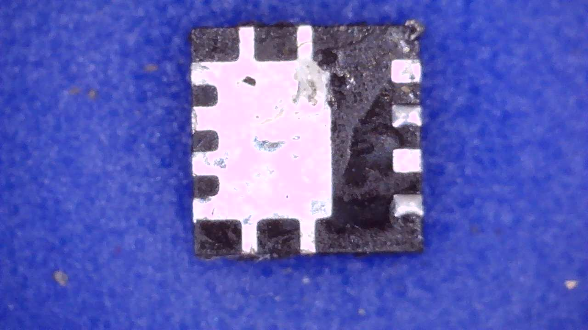
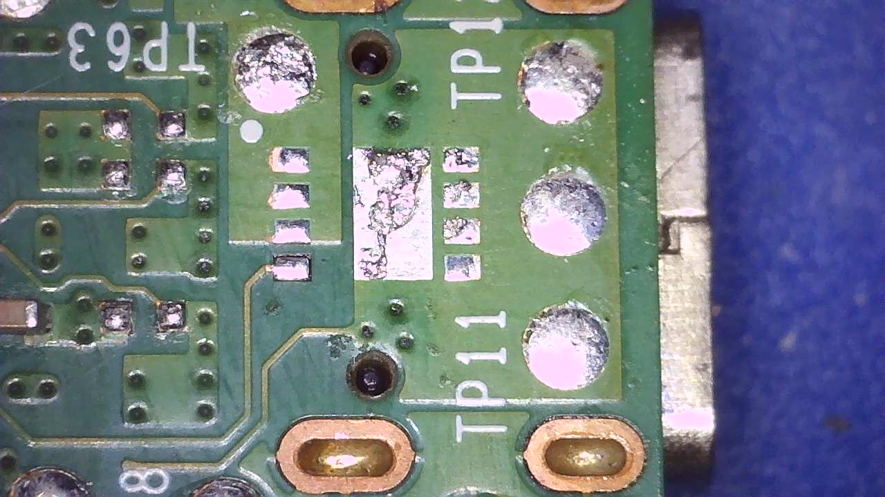
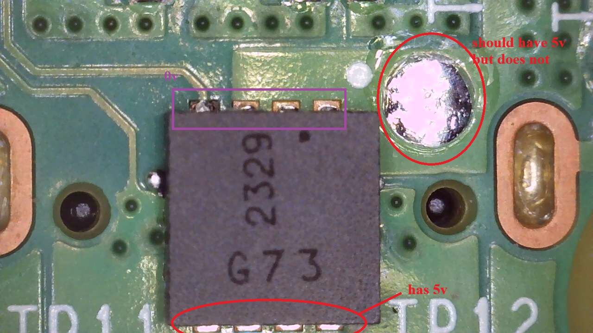
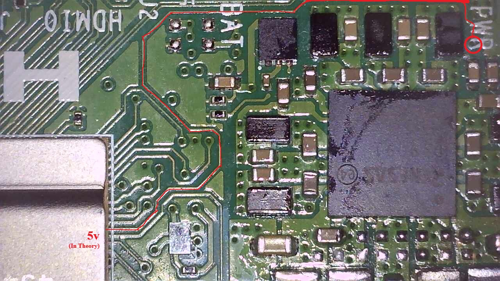

# Raspberry Pi 5 — USB-C Power Path Switch (Board Marking: G73)

This documents the MOSFET or MOSFET-based load switch located between the USB-C connector and the 5V power rail on
the Raspberry Pi 5. The chip carries a top marking of **G73** and sits in a POWERDI3333-8 (or similar) footprint.

**NOTE:** The names and pin designations used here are best estimates from research. Some details may be incorrect.

> **TODO:** Determine whether this is a bare N-Channel MOSFET or an integrated load switch IC (which would include
> soft-start, overcurrent protection, etc. in addition to the FET). The package and position are consistent with
> either.

## Role

This component acts as the power switch in the USB-C input path. It gates the 5V supply from the USB-C connector onto
the board's main 5V rail. If this component fails (short or open), common symptoms include:

- Board draws no power / no LEDs at all (open failure)
- Board pulls excessive current and won't boot (short failure)
- USB-C power negotiation succeeds but voltage never reaches the 5V rail

> **TODO:** Confirm this is actually switching the main 5V rail vs. a sub-rail.

## Location

The chip is on the underside of the board, between the USB-C connector and the PMIC area, near test points **TP63**
and **TP11** (both on the 5V rail). A via near the G73 footprint connects to a trace on the top side of the board.

### Images

| Image | Description |
|-------|-------------|
|  | Chip on the board before removal |
|  | Underside of actual chip after being pulled from the board |
|  | Board pads/footprint after chip removal |

## Identification

- **Board marking:** G73
- **Package:** POWERDI3333-8 (or compatible 3.3mm × 3.3mm power package)
- **Type:** N-Channel MOSFET or integrated load switch
- **Function:** USB-C 5V input power switching

> **TODO:** Confirm package dimensions with calipers against POWERDI3333-8 spec (3.3mm x 3.3mm).

## Potential Replacement (UNVERIFIED)

> ⚠️ **WARNING:** The following replacement has **NOT** been proven to work. It is a theoretical match based on
> package, voltage rating, current rating, and application suitability. **Use at your own risk.** If you attempt
> this replacement, please report your results.

**Candidate:** Diodes Incorporated **DMG7430LFG-7**

- **Description:** N-Channel 30V 10.5A MOSFET, POWERDI3333-8
- **DigiKey:** [DMG7430LFG-7](https://www.digikey.com/en/products/detail/diodes-incorporated/DMG7430LFG-7/2951997)

### Why this candidate

- Package footprint (POWERDI3333-8) matches what appears on the board
- 30V / 10.5A rating is appropriate for a 5V/5A USB-C power path
- Very low RDS(ON) minimizes voltage drop at high current draw
- Designed for power-management / DC-DC converter switching applications

### What remains unconfirmed

- Whether the original part is actually a DMG7430LFG (the "G73" marking is suggestive but not conclusively traced
  to a specific datasheet marking table)
- Pin-for-pin compatibility with the Pi 5 footprint
- Gate drive voltage/timing compatibility with the Pi 5's power sequencing
- Thermal behavior in the Pi 5's specific board layout

## Testing the G73

To determine if this MOSFET has failed, probe the pads with the board powered via USB-C.

In the image above, the 4 input pads (USB-C side) show **5V** as expected. The output pads (5V rail side) show
**0V** — confirming the MOSFET is not passing power through.

> **TODO:** Confirm drain/source orientation. Assuming drain = USB-C input, source = 5V rail output based on
> typical N-Channel high-side MOSFET topology. Verify against actual pad continuity measurements.

### Procedure

1. Connect a known-good USB-C power supply to the board.
2. Set your multimeter to DC voltage, black probe on a known ground (e.g., USB-C shield or TP8).
3. Probe the **input pads** (USB-C side) — you should see ~5V if the supply is working.
4. Probe the **output pads** (5V rail side) — on a working board these should also read ~5V.
5. If inputs read 5V but outputs read 0V, the MOSFET is open/failed.

### Expected Voltages

| Pad Group | Failed Board | Working Board |
|-----------|-------------|---------------|
| Input (USB-C side) | ~5V | ~5V |
| Output (5V rail side) | 0V | ~5V |
| Gate (purple in image) | TODO | TODO |

> **TODO:** Probe gate pad voltages on a known-working Pi 5 to document expected values. This will help
> distinguish between a failed MOSFET and a gate drive issue from the control circuitry.

## Off-Board Testing (Chip Removed)

If you've already pulled the G73, you can test it with a multimeter in **diode mode**:

### Body Diode Check

1. Red probe on source pads (5V rail side), black probe on drain pads (USB-C side).
2. You should read **~0.4–0.7V** (the internal body diode).
3. Reverse the probes — should read **OL** (open/no conduction).

**Interpreting results:**
- OL in both directions → open failure, chip is dead
- Near-zero in both directions → short failure, chip is dead
- ~0.5V one way, OL the other → body diode intact (chip may still be functional)

### Gate Check

1. Probe gate pad to source — should read **OL** in both directions.
2. Probe gate pad to drain — should read **OL** in both directions.
3. Low resistance from gate to either source or drain indicates blown gate oxide.

### Self-Turn-On Test (bare MOSFET only)

This only works if the chip is a bare MOSFET, not a load switch IC:

1. Briefly touch red probe to gate pad (charges the gate).
2. Move red probe to source, black on drain — a working FET should now show low resistance (conducting).
3. Short gate to source with a jumper wire to discharge.
4. Re-measure drain-source — should return to OL/body diode reading.

If the FET never conducts after gate charge, it's dead. If it's a load switch IC, the gate isn't directly
accessible externally so this test won't apply — rely on the body diode check instead.

## 5V Trace to SoC

There is a trace connected to the **input side** of the G73 that drops through a via to the top side of the board,
where it routes toward the SoC.

| Image | Description |
|-------|-------------|
|  | Underside — via visible near the input pads |
|  | Top side — red line highlights the trace routing toward the SoC |

The red line in the second image traces the path from where the via emerges on the top layer, routing toward the
SoC (large QFN package). The annotation "5v (In Theory)" indicates this trace likely carries the raw USB-C 5V
input — i.e., the **pre-switch** voltage, before the G73 gates it onto the main 5V rail.

This suggests the SoC (or nearby control logic) may have a direct connection to the USB-C input voltage,
independent of whether the G73 is conducting. The significance of this trace is not yet fully understood.

> **TODO:** Determine where this trace terminates. Possibilities include:
> - Voltage sense line for the SoC or PMIC
> - Power-good signal input
> - Part of the USB-PD negotiation feedback path
> - Direct 5V supply to a specific sub-circuit

## Diagnostic Notes

When troubleshooting a Pi 5 that has no power indicators at all despite a known-good USB-C supply:

1. Check for 5V presence at the USB-C connector pads (confirms cable/supply are good)
2. Check for 5V on the downstream side of this MOSFET (confirms it is passing power)
3. If 5V is present at USB-C but not downstream, this MOSFET is a likely suspect
4. Measure resistance across drain-source with the board unpowered — a short or open reading (vs. expected
   MOSFET diode behavior) indicates failure
